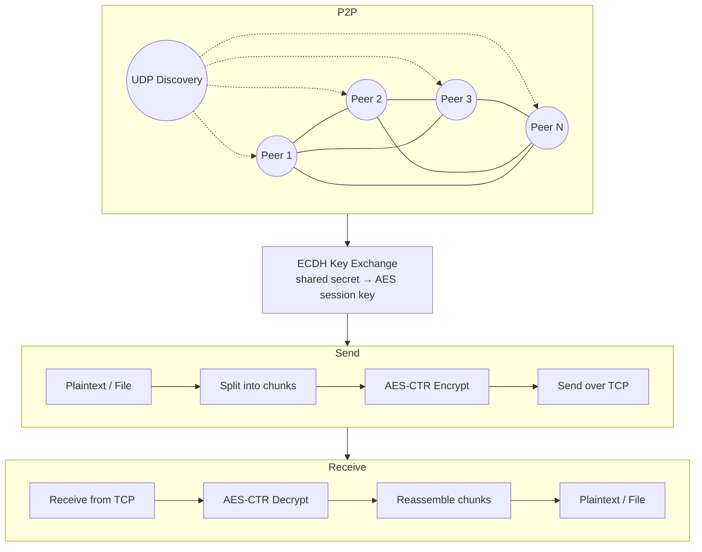

# Distributed Encrypted Communication System

Peer-to-peer encrypted messaging and file transfer between stations over TCP/UDP

```mermaid
graph TB
    subgraph MESH["P2P"]
        direction LR
        DISC(("UDP Discovery"))
        P1(("Peer 1"))
        P2(("Peer 2"))
        P3(("Peer 3"))
        PN(("Peer N"))

        DISC -.-> P1 & P2 & P3 & PN
        P1 --- P2
        P2 --- P3
        P3 --- PN
        PN --- P1
        P1 --- P3
        P2 --- PN
    end

    MESH --> HANDSHAKE["ECDH Key Exchange<br/>shared secret → AES session key"]

    HANDSHAKE --> SEND

    subgraph SEND["Send"]
        E1["Plaintext / File"] --> E2["Split into chunks"] --> E3["AES-CTR Encrypt"] --> E4["Send over TCP"]
    end

    SEND --> RECV

    subgraph RECV["Receive"]
        D1["Receive from TCP"] --> D2["AES-CTR Decrypt"] --> D3["Reassemble chunks"] --> D4["Plaintext / File"]
    end
```